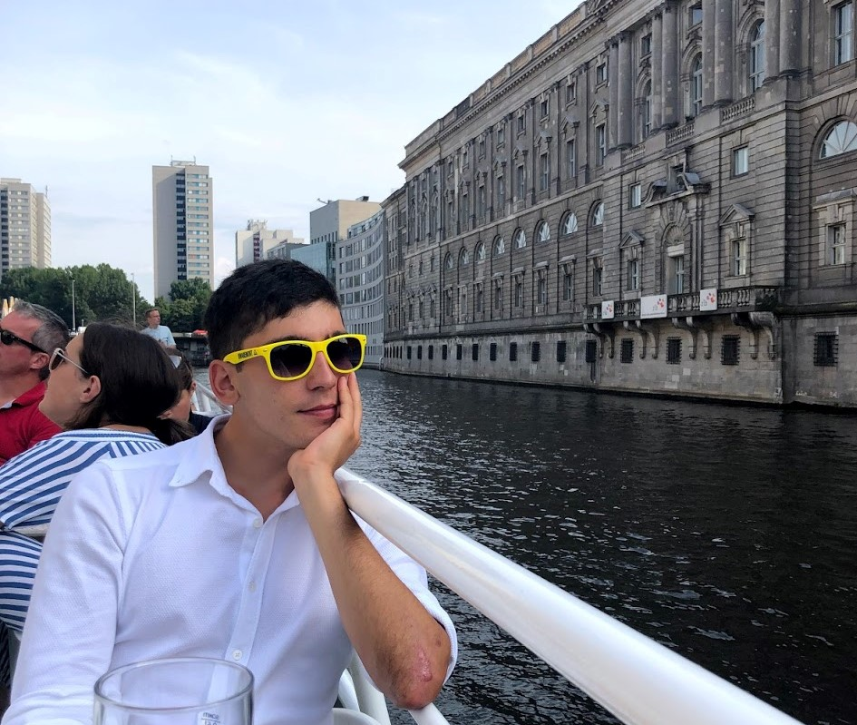

I am a fourth year graduate student in the MIT AeroAstro department. 
My current research focuses on methods for enabling engineering design
using tractable global optimization, using [geometric
 programming](https://gpkit.readthedocs.io/en/latest/gp101.html)
and its non-log-convex extension [signomial 
programming](https://gpkit.readthedocs.io/en/latest/signomialprogramming.html).
As such, much of my research occurs at the intersection of optimization, 
machine learning and engineering. 

I am a member of the [Convex Engineering Group](https://convex.mit.edu/), 
a group of students interested in leveraging convexity to improve
the design process. During a typical work week I live and work
with my colleagues in
the [Aerospace Computational Design Lab](http://acdl-web.mit.edu/). 

_Work in progress..._
